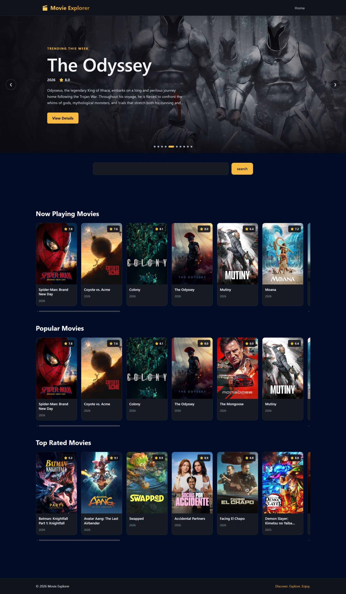
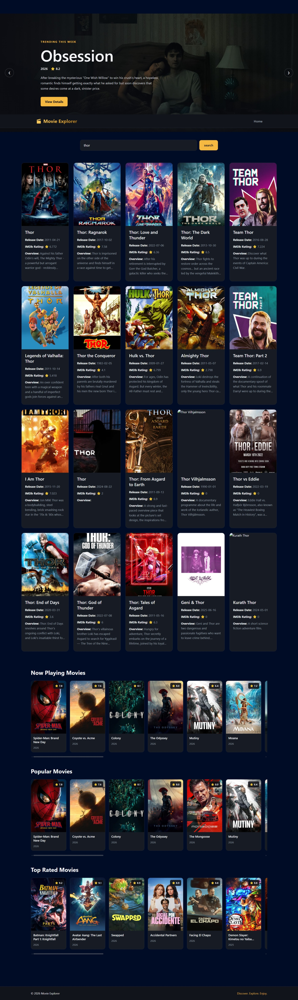
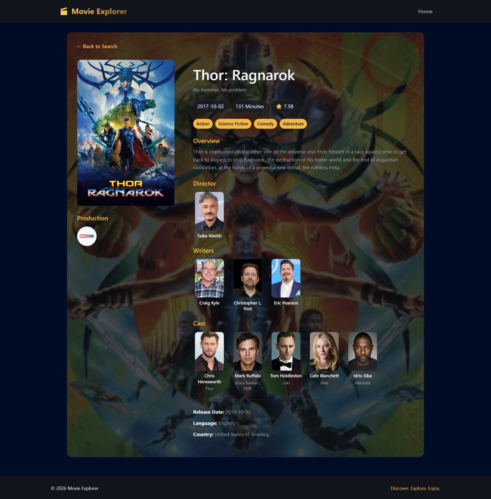

# 🎬 Movie Explorer

A modern, responsive movie discovery application built with **React** and the **TMDB API**.

Movie Explorer allows users to search for movies, explore trending and popular titles, browse now-playing and top-rated movies, and view detailed information about individual movies through a cinematic responsive interface.

---

## 🌐 Live Demo

🔗 **Live Demo:** https://movie-explorer-kappa-nine.vercel.app/

🔗 **GitHub Repository:** https://github.com/Fahad-8943/Movie-Explorer

---

## 📸 Screenshots

### 🏠 Home Page


### 🔎 Movie Search


### 🎬 Movie Details


---

# ✨ Features

### 🏠 Movie Discovery

- Trending movies
- Now Playing movies
- Popular movies
- Top Rated movies
- Cinematic hero section
- Movie ratings
- Release dates
- Movie overviews

### 🔥 Trending Hero Carousel

- Weekly trending movies from TMDB
- Automatic slide rotation
- Previous/Next navigation
- Slide indicators
- Movie title and overview
- Release year
- TMDB rating
- View Details navigation
- Cinematic backdrop images

### 🔎 Movie Search

- Controlled React search input
- TMDB movie search
- Search result grid
- Empty-search validation
- Loading states
- Error handling
- Movie detail navigation

### 🎬 Movie Cards

Each movie is displayed using a reusable `MovieCard` component containing:

- Poster
- Title
- Release date/year
- TMDB rating
- Overview
- Hover interactions
- Navigation to movie details

### 📋 Movie Details

The dedicated movie details page displays:

- Movie poster
- Backdrop
- Title
- Tagline
- Release date
- Runtime
- TMDB rating
- Genres
- Overview
- Director
- Writers
- Main cast
- Character names
- Spoken languages
- Production countries
- Production companies

Movie credits are retrieved using TMDB's `append_to_response=credits` functionality.

### 📱 Responsive Design

The application is designed for:

- Desktop
- Tablet
- Mobile

The layout adapts through responsive grids, horizontal movie sections, navigation changes, typography adjustments, and mobile-friendly movie details.

### ⚠️ Error Handling

The application handles:

- Loading states
- Empty searches
- API errors
- 401 responses
- 404 responses
- 500 responses
- Network/request failures
- Movie-not-found states
- Unknown routes

### 🚫 Custom 404 Page

A dedicated `PageNotFound` component handles invalid routes and provides navigation back to the home page.

---

# 🧭 Application Flow

```text
                         HOME
                          │
            ┌─────────────┼─────────────┐
            │             │             │
            ▼             ▼             ▼
         SEARCH       TRENDING       MOVIE ROWS
            │             │             │
            └─────────────┼─────────────┘
                          │
                          ▼
                     MOVIE CARD
                          │
                          ▼
                  MOVIE DETAILS
```

---

# 🏗️ Architecture

The project separates UI logic from API communication.

```text
React Components
       │
       ▼
    allApi.js
       │
       ▼
  apiService.js
       │
       ▼
axiosInstance.js
       │
       ▼
    TMDB API
```

### `allApi.js`

Contains domain-specific API functions for:

- Movie search
- Movie details
- Trending movies
- Now Playing movies
- Popular movies
- Top Rated movies

### `apiService.js`

Provides a reusable wrapper for Axios requests.

It handles:

- HTTP method
- URL
- Query parameters
- Request data

### `axiosInstance.js`

Contains the centralized Axios configuration:

- TMDB base URL
- Authorization
- Request headers
- Request timeout
- Response interceptor

This keeps API configuration centralized instead of repeating it throughout components.

---

# 🌐 TMDB API Endpoints

### Search

```http
GET /search/movie
```

Searches for movies.

### Movie Details

```http
GET /movie/{movie_id}
```

Retrieves movie information.

Credits are included using:

```text
append_to_response=credits
```

### Trending

```http
GET /trending/movie/week
```

Used by the trending hero section.

### Now Playing

```http
GET /movie/now_playing
```

### Popular

```http
GET /movie/popular
```

### Top Rated

```http
GET /movie/top_rated
```

---

# 🛠️ Tech Stack

### Frontend

- React
- JavaScript
- JSX
- HTML5
- CSS
- React Router

### API & Networking

- Axios
- TMDB API
- REST API

### Development Tools

- Vite
- ESLint
- npm
- Git
- GitHub
- Vercel

---

# 📦 Main Dependencies

```text
react
react-dom
react-router-dom
axios
```

Development dependencies include:

```text
vite
eslint
@vitejs/plugin-react
eslint-plugin-react-hooks
eslint-plugin-react-refresh
```

---

# 📁 Project Structure

```text
movie-explorer/
│
├── public/
│
├── src/
│   │
│   ├── assets/
│   │
│   ├── components/
│   │   ├── ErrorMessage/
│   │   ├── Footer/
│   │   ├── Header/
│   │   ├── Hero/
│   │   ├── Loader/
│   │   ├── MovieCard/
│   │   ├── MovieGrid/
│   │   ├── MovieRow/
│   │   └── SearchBar/
│   │
│   ├── pages/
│   │   ├── Home/
│   │   ├── MovieDetails/
│   │   └── PageNotFound/
│   │
│   ├── services/
│   │   ├── allApi.js
│   │   ├── apiService.js
│   │   └── axiosInstance.js
│   │
│   ├── App.jsx
│   ├── App.css
│   ├── index.css
│   └── main.jsx
│
├── vercel.json
├── package.json
├── package-lock.json
└── README.md
```

---

# ⚛️ React Concepts Used

This project helped strengthen understanding of:

- Functional components
- Props
- `useState`
- `useEffect`
- `useParams`
- `useNavigate`
- Controlled inputs
- Conditional rendering
- Component composition
- State lifting
- Dynamic routes
- Reusable components
- Loading and error states

---

# 🔄 Data Flow

## Movie Search

```text
User Input
    ↓
SearchBar
    ↓
Home
    ↓
searchMovies()
    ↓
allApi.js
    ↓
apiService.js
    ↓
axiosInstance
    ↓
TMDB API
    ↓
Movie Results
    ↓
MovieGrid
    ↓
MovieCard
```

## Movie Details

```text
User clicks Movie Card
        ↓
React Router
        ↓
/MovieDetails/:id/view
        ↓
useParams()
        ↓
getMovieDetail(id)
        ↓
TMDB API
        ↓
Movie + Credits
        ↓
Data Transformation
        ↓
Movie Details UI
```

---

# 🧠 Data Transformation

The TMDB response is processed before being displayed.

The application extracts information such as:

- Director from crew
- Writers from crew
- Main actors from cast
- Character names

Writer information is de-duplicated using JavaScript's `Set`.

---

# 🧩 Reusable Components

### `MovieCard`

Displays individual movie information.

### `MovieGrid`

Displays movies in a responsive grid.

### `MovieRow`

Displays movie collections horizontally.

Used for:

- Now Playing
- Popular
- Top Rated

### `SearchBar`

Handles movie search input.

### `Hero`

Displays the trending movie carousel.

### `Loader`

Provides reusable loading feedback.

### `ErrorMessage`

Provides reusable error UI.

---

# 🎨 UI Design

Movie Explorer uses a cinematic dark interface designed around movie artwork.

### Design characteristics

- Dark background
- Cinematic backdrops
- Gold accent color
- Rounded movie cards
- Gradient overlays
- Hover effects
- Smooth transitions
- Responsive grids
- Large movie artwork
- Clear visual hierarchy

---

# 📱 Responsive Layout

The movie details page uses a two-column desktop layout:

```text
┌──────────────┬───────────────────────────┐
│              │                           │
│    Poster    │      Movie Information    │
│              │                           │
│              │      Cast / Crew          │
│              │      Genres               │
└──────────────┴───────────────────────────┘
```

On smaller screens the layout changes to a single-column structure.

---

# 🔐 Environment Variables

Create a `.env` file:

```env
VITE_TMDB_ACCESS_TOKEN=your_tmdb_access_token
```

Never commit your real token to GitHub.

Add:

```text
.env
.env.local
```

to `.gitignore`.

> **Important:** If a TMDB token has already been pushed to a public repository, regenerate/revoke that token before publishing the project.

---

# 🚀 Getting Started

## 1. Clone the repository

```bash
git clone YOUR_GITHUB_REPOSITORY_URL
```

## 2. Navigate into the project

```bash
cd movie-explorer
```

## 3. Install dependencies

```bash
npm install
```

## 4. Add your TMDB token

Create `.env`:

```env
VITE_TMDB_ACCESS_TOKEN=your_tmdb_access_token
```

## 5. Start the development server

```bash
npm run dev
```

---

# 📜 Available Scripts

### Development

```bash
npm run dev
```

### Production Build

```bash
npm run build
```

### Lint

```bash
npm run lint
```

### Preview

```bash
npm run preview
```

---

# 🌎 Deployment

The application can be deployed using Vercel.

For React Router deep-link handling, the project uses:

```json
{
  "$schema": "https://openapi.vercel.sh/vercel.json",
  "rewrites": [
    {
      "source": "/(.*)",
      "destination": "/index.html"
    }
  ]
}
```

This allows routes such as:

```text
/MovieDetails/123/view
```

to work correctly when directly accessed.

---

# 📚 What I Learned

Building Movie Explorer helped strengthen my understanding of:

- React component architecture
- Props
- State management
- `useState`
- `useEffect`
- React Router
- Dynamic routes
- URL parameters
- Controlled inputs
- Axios
- REST API integration
- Async/Await
- Promises
- `Promise.all()`
- Error handling
- Conditional rendering
- Reusable components
- Responsive CSS
- CSS transitions
- API data transformation
- JavaScript array methods

---

# 🧠 JavaScript Concepts Used

The project makes use of array methods such as:

```text
map()
filter()
find()
findIndex()
slice()
```

These are used for tasks such as:

- Rendering movie lists
- Finding directors
- Filtering writers
- Selecting actors
- Processing API responses

### `Promise.all()`

Used to handle independent movie category requests together:

```text
Popular
Top Rated
Now Playing
```

### `Set`

Used for de-duplicating writer information and other processed data.

---

# 🔧 Challenges Solved

### API Integration

Implemented:

- Centralized Axios configuration
- Reusable API service
- TMDB authentication
- Query parameters
- API response handling

### React Routing

Implemented dynamic URLs such as:

```text
/MovieDetails/123/view
```

### API Error Handling

Handled errors through Axios interceptors and component-level error states.

### Duplicate Data

Processed TMDB credits and prevented duplicate writer entries using `Set`.

### Loading States

Added loading indicators while asynchronous API requests are running.

### Responsive UI

Adapted the interface for desktop, tablet and mobile layouts.

---

# 🚀 Future Improvements

Possible future improvements:

- Favorites / Watchlist
- User authentication
- Persistent favorites
- Genre-based pages
- Pagination
- Infinite scrolling
- Search suggestions
- Movie trailers
- Similar movies
- Recommendations
- Actor details pages
- Skeleton loading
- Better accessibility
- API caching
- Redux Toolkit
- Backend integration

---

# ⚖️ TMDB Attribution

This product uses the TMDB API but is not endorsed or certified by TMDB.

Movie information and images are provided by The Movie Database (TMDB).

🔗 https://www.themoviedb.org/

---

# 👨‍💻 Developer

## Fahad K C

BCA Graduate | MERN / MEAN Stack Developer Trainee

Interested in:

- Full Stack Development
- React
- JavaScript
- Next.js
- Generative AI
- Modern Web Applications

---

# 📬 Connect With Me

**GitHub:** YOUR_GITHUB_URL

**LinkedIn:** YOUR_LINKEDIN_URL

**Portfolio:** YOUR_PORTFOLIO_URL

---

## ⭐ Project Summary

Movie Explorer is a React-based movie discovery application demonstrating component-based architecture, REST API integration, Axios service abstraction, asynchronous JavaScript, dynamic routing, reusable components, data transformation and responsive frontend development.